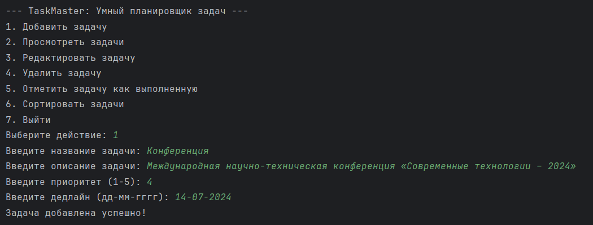

# TaskMaster

TaskMaster - это умный планировщик задач, разработанный на языке Java, который позволяет пользователям создавать, редактировать, удалять и отслеживать задачи. Программа также поддерживает сортировку задач по приоритету и дедлайну, а также возможность пометить задачи как выполненные.

## Оглавление

- [Описание](#описание)
- [Функциональности](#функциональности)
- [Требования](#требования)
- [Установка и запуск](#установка-и-запуск)
- [Использование](#использование)
- [Сохранение и загрузка данных](#сохранение-и-загрузка-данных)
- [Демонстрация работы](#демонстрация-работы)

## Описание

TaskMaster - это приложение для управления задачами, которое предоставляет простой интерфейс для добавления, редактирования, удаления и просмотра задач. Пользователи могут сортировать задачи по приоритету и дедлайну, а также отмечать задачи как выполненные.

## Функциональности

- Добавление новой задачи с указанием названия, описания, приоритета и дедлайна.
- Просмотр списка всех задач.
- Редактирование существующих задач.
- Удаление задач.
- Отметка задач как выполненных.
- Сортировка задач по приоритету и дедлайну.
- Сохранение задач в файл и загрузка из файла.

## Требования

- Java 8 или выше

## Установка и запуск

1. Склонируйте репозиторий с помощью команды:
    ```sh
    git clone https://github.com/makurea/TaskMaster.git
    ```
2. Перейдите в каталог проекта:
    ```sh
    cd TaskMaster
    ```
3. Скомпилируйте проект:
    ```sh
    javac TaskManager.java
    ```
4. Запустите приложение:
    ```sh
    java TaskManager
    ```

## Использование

1. Запустите приложение.
2. Выберите нужное действие из меню:
    - **1. Добавить задачу**: Введите название, описание, приоритет (1-5) и дедлайн (дд-мм-гггг) задачи.
    - **2. Просмотреть задачи**: Отображает список всех задач.
    - **3. Редактировать задачу**: Выберите номер задачи для редактирования и введите новые данные.
    - **4. Удалить задачу**: Выберите номер задачи для удаления.
    - **5. Отметить задачу как выполненную**: Выберите номер задачи для отметки как выполненной.
    - **6. Сортировать задачи**: Выберите способ сортировки (по приоритету или по дедлайну).
    - **7. Выйти**: Сохранить задачи в файл и выйти из программы.

## Сохранение и загрузка данных

TaskMaster автоматически сохраняет задачи в файл **tasks.dat** при выходе и загружает их при запуске. Это обеспечивает сохранение состояния задач между сессиями.

## Демонстрация работы


